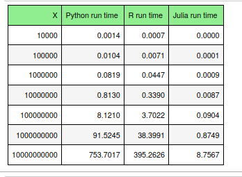

# Python vs Julia vs R speed comparison using a simple function
## Table of contents
* [Python vs R vs Julia](#Python-vs-R-vs-Julia)
* [Code](#Code)


## Python vs R vs Julia

this post is about comparing the speed of Python, R, and Julia in computing the simple function $\sum_{i=1}^X 1/i$.  the runtime results are listed in the following table. 

---
```math
\sum_{i=1}^X 1/i       \quad\quad\quad\quad\quad\quad\quad\quad\quad\quad\quad\quad\quad\quad\quad\quad\quad\quad\quad\quad\quad\quad\quad
```

---
Julia is awesome!!
But wait, don't underestimate Python. Python has something to compete with Julia: numba. See the runtime result in the following table. 

Wow, Python is as fast as Jilia when we use njit.
But still, I believe Julia is much faster than Python for more complex projects...
